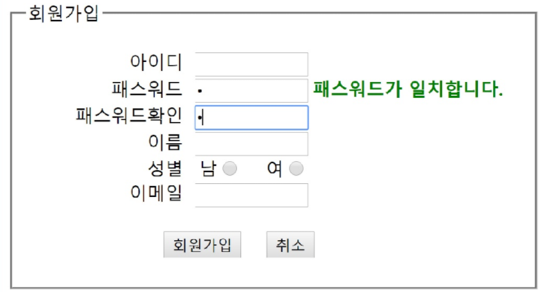

# 요구화면

# 요구사항

Q1. 폼 회원가입에서 회원가입 버튼을 클릭하면 result.html로 이동한다
   
   A1. 가입버튼을 result.html 이동
        
        <form action='result.html'>
            <input type='submit' value='회원가입'/>
        </form>

        <form id='frm'>
            <input type='button' id='btn'/>
        </form>

        $('#btn').on('click',function(){
            $('#frm').submit();
        })

Q2. 아이디, 패스워드, 패스워드 확인, 이름, 이메일 모든 항목은 반드시 입력해야 한다.

    A2. 반드시 입력  required

Q3. 아이디는 라벨을 클릭해도 해당 입력 상자로 포커스 이동한다.

    A3. 라벨을 클릭 

        <label for='user_id' ...> <input type='text' id='user_id'>

Q4. 취소 버튼을 이용해서 입력 상자를 초기화 한다.

    A4. 취소 

        <input type='reset' value='취소'/>

Q5. 아이디는 입력시 첫글자는 대문자이고 나머지 글자는 영문자, 숫자로 총 5글자 이상만 가능하다.

    A5. 첫글자대문자, 영숫자, 5자 이상
        /^[A-Z][A-Za-z0-9]{4,0}/

Q6. 아이디 입력 후 포커스를 잃는 경우에 조건 체크 한다.

    A6. $('#user_id').blur(function(){})

Q7. 조건 체크에 만족하지 않으면 '5글자이상, 첫글자는 대문자이고 영문자, 숫자만 가능'이라는 경고창이 나타난다.

    A7. 
        if(!req.test($(this).val()){
            alert('ERROR');
        })

Q8. 입력한 아이디 값도 삭제한다.

    A8. 
        $('#user_id').val('');
        frm.userid.value='';
        document.getElement('user_id').value='';

Q9.  패스워드 입력 하지 않고 패스워드확인을 입력한 경우 "패스워드를 입력하세요"라는 대화 상자가 나타나고 패스워드확인 값 삭제하고 패스워드 입력 상자로 포커스 이동한다. 패스워드 입력창 옆에 패스워드와 패스워드확인이 일치하면 '패스워드가 일치합니다'라는 문자를 초록색 진하게 출력하고, 일치하지 않으면 '패스워드가 일치하지 않습니다'를 빨간색으로 진하게 출력한다.

    A9. 
        1) 패스워드 확인을 입력한 경우 패스워드항을 체크
            $('#pass_find').on('keyup', function(){
                if($('#pass').val() == ''){
                    alert('암호확인...');
                    $('#pass').focus();
                    $('#pass').val('');
                }
            });
        2) if($('#pass').val() == $('#pass_chk').val()){
                $('#span').html('ok');
                $('#span').css({'color':'green','font-weight':'bolder'})
            } else {
                $('#span').html('Fail');
                $('#span').css({'color':'red','font-weight':'bolder'})
            }

Q10.  성별입력은 회원가입 버튼을 클릭시 남 또는 여 radio 버튼 선택여부 확인한다. 성별입력을 선택하지 않은 경우 '성별을 선택하세요'라는 메시지 출력하고 submit 이벤트 발생하지 않는다.

    A10.  
            if(!$('.gen1:checked') || !$('.gen2:checked)){ fail ... }
            let flag = true;
            let ra = document.frm.gen; //라디오 버튼들
            for(i=0; i<ra.length; i++){
                if(!ra[i].checked) flag=false;
            }
